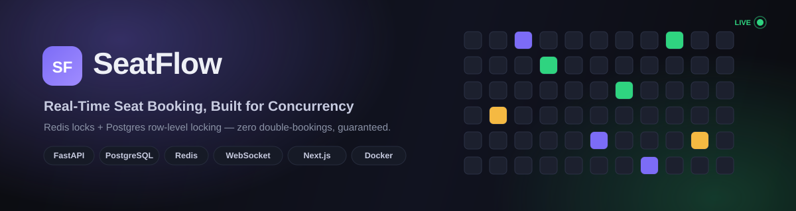
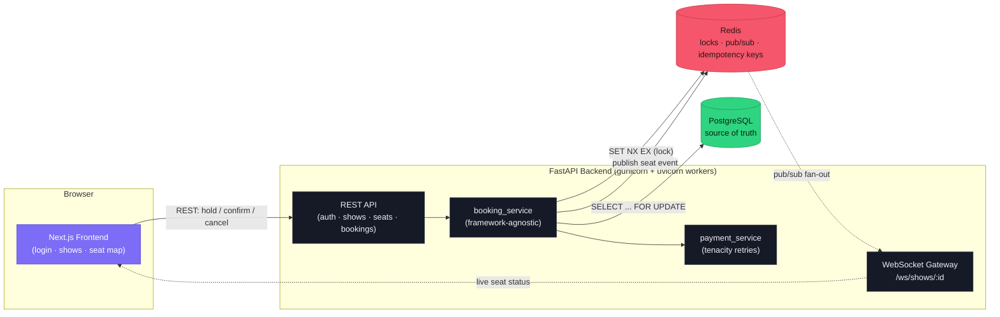
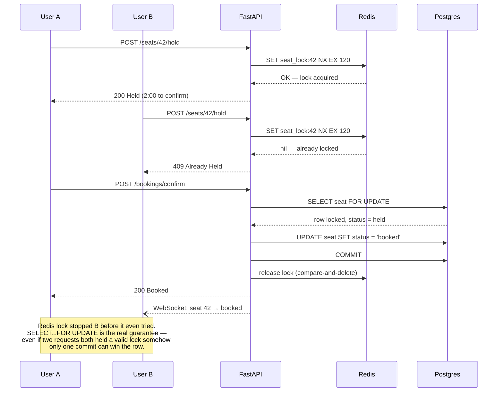

<div align="center">



<br/>

[](https://github.com/Mudavath-Giri-Naik/SeatFlow/actions/workflows/ci.yml)
[](LICENSE)
[](https://www.python.org/)
[](https://fastapi.tiangolo.com/)
[](https://www.postgresql.org/)
[](https://redis.io/)
[](https://nextjs.org/)
[](Dockerfile)

**A seat-booking backend that cannot double-book a seat — even under real concurrent load.**

[Live Demo](https://seat-flow-lac.vercel.app) · [API Docs](https://seatflow-isd1.onrender.com/docs) · [Report a Bug](https://github.com/Mudavath-Giri-Naik/SeatFlow/issues)

</div>

---

## Table of contents

- [The problem](#the-problem)
- [The solution](#the-solution)
- [Live demo](#live-demo)
- [Features](#features)
- [Architecture](#architecture)
- [How SeatFlow guarantees no double-booking](#how-seatflow-guarantees-no-double-booking)
- [Tech stack](#tech-stack)
- [Project structure](#project-structure)
- [Getting started](#getting-started)
- [API reference](#api-reference)
- [Testing](#testing)
- [Load testing](#load-testing)
- [Deployment](#deployment)
- [Environment variables](#environment-variables)
- [Roadmap](#roadmap)
- [License](#license)

---

## The problem

Every ticketing system — concerts, flights, movies, sports — eventually has to answer the same question under pressure: **when a thousand people click "book" on the same seat in the same second, how do exactly zero of them end up double-booked?**

Naively built booking flows get this wrong constantly:

- **Race conditions** — two requests read "seat available" at the same instant, both proceed to book it, and now two people own the same seat.
- **No hold semantics** — a user picks a seat, gets distracted filling out payment info, and it's yanked away with no warning — or worse, held forever because nothing ever releases it.
- **Retry duplication** — a flaky network causes a client to resend a "confirm booking" request, and the naive backend charges the card and creates the booking twice.
- **Stale UI** — every other user staring at the seat map has no idea the seat they're looking at was just taken, until they refresh and get a rude surprise at checkout.

These aren't edge cases — they're the default outcome of building a booking flow without deliberately designing for concurrency.

## The solution

SeatFlow is a full-stack reference implementation of a booking system that treats concurrency as the primary design constraint, not an afterthought:

| Problem | SeatFlow's answer |
|---|---|
| Two users grabbing the same seat at once | A **Redis lock** (`SET NX EX`) is the first, cheap gate — only one request can ever acquire it |
| A lock and a database somehow disagreeing | **`SELECT ... FOR UPDATE`** on the seat row is the real, authoritative gate at confirm time — the database itself serializes conflicting writers |
| A user who never comes back to pay | Holds carry a **TTL** and self-expire; a reconciliation pass heals any seat left stuck in Postgres past its Redis lock's lifetime |
| A retried "confirm" request double-charging | **Idempotency keys**, stored in Redis, replay the exact same response instead of re-running the booking logic |
| A flaky payment provider | **Exponential backoff retries** (tenacity) before a charge is allowed to fail |
| Stale seat maps | A **WebSocket**, fed by **Redis Pub/Sub**, pushes every hold/confirm/release to every connected client in real time — across multiple backend workers, not just one process |

The result: you can throw hundreds of simulated users at one small pool of seats (see [Load testing](#load-testing)) and the system reports **zero double-bookings**, every time.

## Live demo

| | |
|---|---|
| **Frontend** | [seat-flow-lac.vercel.app](https://seat-flow-lac.vercel.app) |
| **Backend API** | [seatflow-isd1.onrender.com](https://seatflow-isd1.onrender.com) |
| **Interactive API docs** | [seatflow-isd1.onrender.com/docs](https://seatflow-isd1.onrender.com/docs) |
| **Health check** | [seatflow-isd1.onrender.com/health](https://seatflow-isd1.onrender.com/health) |

> Hosted on free tiers — the backend spins down after ~15 minutes idle, so the first request after a while may take 30–60s to wake up. That's a hosting limitation, not the app.

**Try it yourself:** open the frontend in two browser tabs (or one normal + one incognito), sign up as two different users, load the same show, and race each other to hold the same seat. Only one wins — and both tabs update instantly.

## Features

- 🔐 **JWT auth** — signup/login with bcrypt-hashed passwords, access + refresh tokens
- 🪑 **Real-time seat map** — theater-style layout, live status via WebSocket (Redis Pub/Sub backed, so it's correct across multiple backend workers)
- 🔒 **Concurrency-safe holds** — Redis distributed lock with TTL, atomic compare-and-delete release
- 🧾 **Idempotent booking confirmation** — safe to retry, never double-processes or double-charges
- 💳 **Simulated payment gateway** — randomized failures + exponential-backoff retry, to prove the reliability layer actually works
- ⏱️ **Live hold countdown** — client-side timer shows exactly how long you have before your hold expires
- 🚦 **Rate limiting** — per-user request caps on the hot paths (hold / confirm)
- 🌐 **Locked-down CORS** — single allow-listed frontend origin, no wildcard
- 🐳 **One-command full stack** — `docker-compose up` brings up Postgres, Redis, and the API together
- ✅ **Real test coverage** — unit tests (mocked infra) + integration tests (real Postgres/Redis) + a dedicated concurrency test firing simultaneous holds via `asyncio.gather`
- 📈 **Load-tested** — Locust script hammers a small seat pool with hundreds of simulated users and verifies zero double-bookings by querying Postgres directly afterward
- 🔭 **Observability** — structured JSON logging (loguru) + optional Sentry error tracking
- 🚀 **CI/CD** — GitHub Actions: lint → test against real service containers → build → push to GHCR on `main`

## Architecture



## How SeatFlow guarantees no double-booking

This is the actual core of the project. Two users racing for the same seat:



Why **two** layers instead of just trusting Postgres row locks? Latency and load. The Redis check is a single in-memory operation that rejects 999 out of 1000 contending requests before they ever touch the database — `SELECT ... FOR UPDATE` is the correctness guarantee, Redis is what keeps it cheap under real traffic.

## Tech stack

<table>
<tr><th>Layer</th><th>Technology</th><th>Why</th></tr>

<tr><td rowspan="3"><b>Backend</b></td><td>FastAPI (async) + Uvicorn/Gunicorn</td><td>Async all the way down — needed to hold hundreds of concurrent WebSocket + DB-bound requests efficiently</td></tr>
<tr><td>Pydantic</td><td>Request/response validation with almost no boilerplate</td></tr>
<tr><td>PyJWT · passlib + bcrypt</td><td>Stateless auth, industry-standard password hashing</td></tr>

<tr><td rowspan="2"><b>Data</b></td><td>PostgreSQL + SQLAlchemy (async) + Alembic</td><td>ACID transactions and row-level locking are non-negotiable for a booking system</td></tr>
<tr><td>Redis</td><td>Distributed locks, Pub/Sub fan-out for WebSockets, idempotency key storage — one tool, three jobs</td></tr>

<tr><td rowspan="2"><b>Reliability</b></td><td>tenacity</td><td>Exponential-backoff retries around the (simulated) flaky payment provider</td></tr>
<tr><td>Custom idempotency layer</td><td>Makes booking confirmation safe to retry over an unreliable network</td></tr>

<tr><td rowspan="2"><b>Security</b></td><td>slowapi</td><td>Per-user rate limiting on the hold/confirm hot paths</td></tr>
<tr><td>Locked-down CORS</td><td>Single allow-listed origin — no wildcard, ever</td></tr>

<tr><td rowspan="3"><b>Testing</b></td><td>pytest + pytest-asyncio</td><td>Unit tests (mocked) and integration tests (real Postgres/Redis) side by side</td></tr>
<tr><td>Locust</td><td>Load-tests the exact scenario that matters: hundreds of users, one small seat pool</td></tr>
<tr><td>ruff</td><td>Fast linting, enforced in CI</td></tr>

<tr><td rowspan="2"><b>Observability</b></td><td>loguru</td><td>Structured logs — human-readable in dev, single-line JSON in production</td></tr>
<tr><td>Sentry SDK</td><td>Error tracking that no-ops cleanly when no DSN is configured</td></tr>

<tr><td rowspan="2"><b>DevOps</b></td><td>Docker (multi-stage) + docker-compose</td><td>One command brings up the entire stack, dev or prod</td></tr>
<tr><td>GitHub Actions</td><td>Lint → test (real service containers) → build → push to GHCR, on every push</td></tr>

<tr><td><b>Frontend</b></td><td>Next.js 14 (App Router) + TypeScript</td><td>Server-friendly React with file-based routing — no client-side router boilerplate</td></tr>

<tr><td rowspan="2"><b>Hosting</b></td><td>Render</td><td>Backend — Docker-native, managed Postgres + Redis</td></tr>
<tr><td>Vercel</td><td>Frontend — zero-config Next.js deploys</td></tr>
</table>

## Project structure

```
SeatFlow/
├── app/
│   ├── main.py              # FastAPI app, router wiring, middleware
│   ├── core/                # config, DB engine, Redis client, JWT/security, logging, Sentry, rate limiting
│   ├── models/               # SQLAlchemy async models: User, Venue, Show, Seat, Booking
│   ├── schemas/              # Pydantic Create/Read schemas
│   ├── services/              # business logic — booking_service.py has zero FastAPI imports
│   └── api/                  # routers: auth, catalog, seats, bookings, websocket, health
├── alembic/                  # migrations
├── tests/
│   ├── unit/                 # booking_service with Redis/DB mocked
│   └── integration/           # real Postgres/Redis, incl. the asyncio.gather concurrency test
├── scripts/seed.py            # demo data seeder
├── frontend/
│   ├── app/                  # /login, /shows, /shows/[id]
│   ├── components/            # Header, etc.
│   └── lib/                  # typed API client, auth context, toast system
├── locustfile.py              # load test + automated double-booking check
├── Dockerfile                 # multi-stage build, non-root, gunicorn+uvicorn workers
├── docker-compose.yml         # postgres + redis + backend, one command
└── .github/workflows/ci.yml    # lint → test → build → push to GHCR
```

## Getting started

### Prerequisites
Docker Desktop · Python 3.12+ · Node 20+

### 1. Clone and configure
```bash
git clone https://github.com/Mudavath-Giri-Naik/SeatFlow.git
cd SeatFlow
cp .env.example .env
# edit .env — set JWT_SECRET_KEY to any long random string
```

### 2. Start Postgres + Redis
```bash
docker compose up -d postgres redis
```

### 3. Install dependencies and migrate
```bash
python -m venv .venv
.venv\Scripts\activate      # Windows — use `source .venv/bin/activate` on macOS/Linux
pip install -r requirements.txt
alembic upgrade head
python -m scripts.seed
```

### 4. Run the backend
```bash
uvicorn app.main:app --reload
```
API live at `http://localhost:8000` · interactive docs at `http://localhost:8000/docs`

### 5. Run the frontend
```bash
cd frontend
cp .env.local.example .env.local
npm install
npm run dev
```
Open `http://localhost:3000`, sign up, pick a show, book a seat.

**Or skip steps 3–4 entirely** and run the whole backend in Docker:
```bash
docker compose up --build
```
Migrations apply automatically on container start.

## API reference

| Method | Endpoint | Auth | Description |
|---|---|---|---|
| `POST` | `/auth/signup` | – | Create an account |
| `POST` | `/auth/login` | – | Get access + refresh tokens |
| `POST` | `/auth/refresh` | – | Rotate an access token |
| `GET` | `/auth/me` | ✅ | Current user |
| `GET` | `/shows` | – | Browse all shows (venue nested) |
| `GET` | `/shows/{id}` | – | Single show |
| `GET` | `/shows/{id}/seats` | – | Full seat map, self-heals expired holds |
| `POST` | `/seats/{id}/hold` | ✅ | Acquire a short-lived hold — rate-limited |
| `POST` | `/bookings/confirm` | ✅ | Confirm a held seat — requires `Idempotency-Key` header, rate-limited |
| `POST` | `/bookings/{id}/cancel` | ✅ | Cancel a held or confirmed booking |
| `WS` | `/ws/shows/{id}` | – | Live seat status stream |
| `GET` | `/health` | – | DB + Redis connectivity check |

Full interactive docs (request/response schemas, try-it-now): `/docs` on any running instance.

## Testing

```bash
pytest tests/unit          # no infra required
docker compose up -d postgres redis
pytest                     # full suite, incl. the concurrency test
```

The one that matters most — `tests/integration/test_concurrency.py` — fires simultaneous `hold_seat` calls at the same seat with `asyncio.gather` and asserts exactly one succeeds. Every time.

## Load testing

```bash
docker compose up -d
locust -f locustfile.py --headless -u 1000 -r 100 --host http://localhost:8000
```

Seeds a pool of 15 seats and throws hundreds of simulated users at hold/confirm concurrently. At the end it queries Postgres directly for any seat with more than one `confirmed` booking — that count must be, and is, zero.

## Deployment

Full click-by-click walkthrough (Render for the backend, Vercel for the frontend, including exactly which repo folder to point each platform at) is in [`docs/DEPLOYMENT.md`](docs/DEPLOYMENT.md).

Short version:
1. **Render** → New Web Service → point at repo root (the `Dockerfile` lives there) → add managed Postgres + Redis → set env vars → deploy (migrations run automatically).
2. **Vercel** → New Project → set Root Directory to `frontend` → set `NEXT_PUBLIC_API_URL` / `NEXT_PUBLIC_WS_URL` to the Render URL → deploy.
3. Update the backend's `FRONTEND_ORIGIN` to the Vercel URL so CORS allows it.

## Environment variables

| Variable | Required | Description |
|---|---|---|
| `DATABASE_URL` | ✅ | Async Postgres DSN (`postgresql+asyncpg://...`) |
| `REDIS_URL` | ✅ | Redis connection string |
| `JWT_SECRET_KEY` | ✅ | Long random string signing all tokens |
| `JWT_ALGORITHM` | – | Default `HS256` |
| `ACCESS_TOKEN_EXPIRE_MINUTES` | – | Default `15` |
| `REFRESH_TOKEN_EXPIRE_DAYS` | – | Default `7` |
| `PAYMENT_GATEWAY_API_KEY` | – | Any placeholder — the gateway is mocked |
| `FRONTEND_ORIGIN` | ✅ | Exact frontend origin allowed by CORS |
| `SEAT_HOLD_TTL_SECONDS` | – | Default `120` |
| `SENTRY_DSN` | – | Optional — Sentry no-ops cleanly if unset |
| `ENVIRONMENT` | – | `development` / `production` — flips log format |

See `.env.example` for the full annotated list.

## Roadmap

- [ ] Real payment provider integration (Stripe) behind the same retry/idempotency layer
- [ ] "My Bookings" page with booking history
- [ ] Background reconciliation worker to broadcast WS events on hold-TTL expiry (currently self-heals lazily on next read)
- [ ] Seat-level pricing tiers and venue seating charts (curved rows, sections)
- [ ] Horizontal scaling test — multiple backend replicas behind a load balancer

## License

MIT — see [LICENSE](LICENSE).

---

<div align="center">

Built by **[Mudavath Giri Naik](https://github.com/Mudavath-Giri-Naik)**

If this project was useful or interesting, a ⭐ on the repo is appreciated.

</div>
